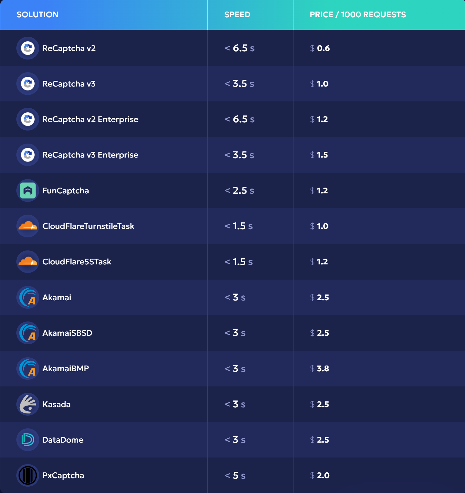

# 最便宜最快的验证码解决方案提供商——EzCaptcha

[English](README.md)|中文版

EZCaptcha 是一款基于人工智能和机器学习技术的验证码解决服务，专门设计用于自动化绕过各种验证码挑战。它通过先进的算法和机器学习技术，能够在瞬间识别并绕过多种类型的验证码，为用户提供高效、便捷的验证体验。

***官方网址：https://www.ez-captcha.com/*** 

- 响应速度快至2秒

- 处理大量并发请求，同时保持顶级可用性

- 开发者返利高至20%

EZCaptcha 具有**强大的兼容性**，可以适应各种验证码类型：

**高精度识别**

EZCaptcha 采用机器学习算法，确保验证码的高成功率。其识别准确率经过不断优化，成功率可达到 ***99%***。

#### Contact & Links

Website: https://www.ez-captcha.com/

Telegram Group: https://t.me/+NrVmPhlb9ZFkZGY5

Discord: https://discord.gg/nDgSBurAVh

#### 服务简介

[EzCaptcha: 领先的AI验证码解决方案](docs/zh/EzCaptcha-领先的AI验证码解决方案.md)

## 目录

- [如何判断reCaptcha版本](docs/zh/如何判断reCaptcha版本.md)   
- [reCAPTCHA中sa参数的作用](docs/zh/reCAPTCHA中sa参数的作用.md)   
- [如何获得reCAPTCHA v3 高分](docs/zh/如何获得reCAPTCHAv3高分.md)
