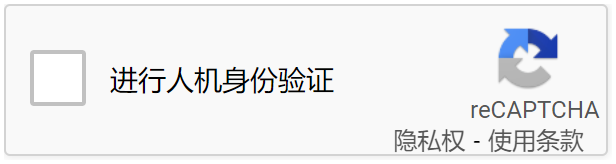

# 如何判断reCAPTCHA版本


### 方法一：通过样式来判断版本

可以通过样式来判断版本，但无法判断是否是企业版

**ReCaptcha V2**

如果出现以下这种需要勾选的，可以判断为`reCaptcha v2`



但是V2普通版和企业版外形上看起来是一样的，这个方法看不出区别

`reCaptcha v2 普通版` 示例：[ReCAPTCHA demo](https://www.google.com/recaptcha/api2/demo)

**ReCaptcha V2 invisible**

invisible版本会将勾选框隐藏，您可能需要提交表单时候才可能触发需要您选择图片的那个页面

`reCaptcha v2 invisible`示例：[ReCAPTCHA demo](https://www.google.com/recaptcha/api2/demo?invisible=true)

**ReCaptcha V3**

`reCaptcha v3` 是一种无感验形式，不需要用户点击验证，会自动进行验证。这种类型也没有任何样式显示，很容易与reCaptcha V2 invisible弄混，而且普通版还是企业版用这种方法也无法直观判断。

对于v3版本，谷歌根据各种环境因素，对用户进行打分，分数从0.1~0.9不等，分数越大越接近人类，网站可以根据用户的分数来判断是否给予通过

### 方法二：通过浏览器控制台查看Network进行判断

打开网页，按 F12->Network，

#### **ReCaptcha V2**

搜索`api.js`，如果请求链接不含render参数，或者render参数为`explicit`，例如：


```
https://www.google.com/recaptcha/api.js https://www.google.com/recaptcha/api.js?onload=onloadcallback&render=explicit
```

也可以搜索`anchor`，例如：

```
https://www.google.com/recaptcha/api2/anchor?ar=1&k=6LcbPQsTAAAAAB7gt1_a0tDBPojRuzgfe_Z_wW_f&co=aHR0cHM6Ly93d3cuc2VycHJvYm90LmNvbTo0NDM.&hl=zh-CN&v=3kTz7WGoZLQTivI-amNftGZO&size=normal&cb=d2rs6bua44wr 
```

只要url前缀是`https://www.google.com/recaptcha`，说明为普通版，而不是企业版。对于v2 普通版而言，Url中的`size`参数为`normal`

 

**ReCaptcha V2 invisible**

与V2 普通版一样，请求链接不含render参数，或者render参数为`explicit`

```
https://www.google.com/recaptcha/api.js https://www.google.com/recaptcha/api.js?onload=onloadcallback&render=explicit
```

符合上述条件，并且搜索`anchor`的url中有`size=invisible`参数，则可能为invisible版本，例如

```
https://www.google.com/recaptcha/api2/anchor?ar=1&k=6LdDCdYcAAAAANPaWKlIKYBRPNQirZFckBZKgZzj&co=aHR0cHM6Ly91bnVzdWFsd2hhbGVzLmNvbTo0NDM.&hl=en-US&type=image&v=5qcenVbrhOy8zihcc2aHOWD4&theme=light&size=invisible&badge=bottomright&cb=sym595bmbzux
```

 

**ReCaptcha V2 Enterprise**

与上述的条件一样，唯一不同的是`https://www.google.com/recaptcha/api.js` url变为`https://recaptcha.net/recaptcha/enterprise.js`

其余url例如`https://www.google.com/recaptcha/api2/anchor`变为`https://www.google.com/recaptcha/enterprise/anchor`

 

 **ReCaptcha V3**

请求链接含有render参数，并且render参数不等于`explicit`，例如：


```
https://www.google.com/recaptcha/api.js?render=6LdyC2cUAAAAACGuDKpXeDorzUDWXmdqeg-xy696
```

在`anchor` 接口url中，`size`参数只会为`size=invisible`

#### **ReCaptcha V3 Enterprise**

与reCaptcha v3条件一样，区别在于`https://www.google.com/recaptcha/api.js` url变为`https://recaptcha.net/recaptcha/enterprise.js`

 

注意，如果浏览器网络请求中没有发现`api.js`或`enterprise.js` ，请清空浏览器缓存再次刷新